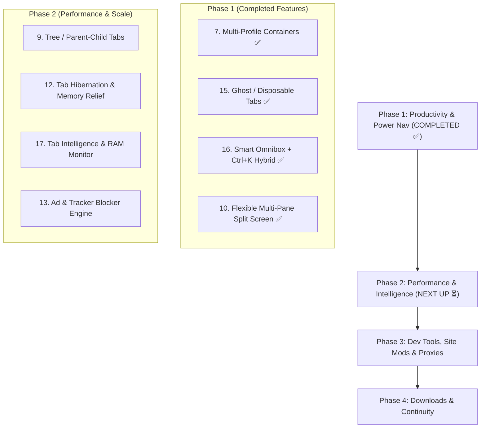

# MyNetwork Browser — Master Roadmap & Feature Tracker (ROADMAP_TODO.md)

> **Architectural Vision:** High-performance, privacy-first, developer-centric desktop browser built on macOS Sonoma/Sequoia native design principles with isolated project workspaces, multi-profile containers, split-screen multitasking, and smart tab intelligence.

---

## 📊 Feature Status Summary

| Status Badge | Meaning | Feature Count |
|---|---|:---:|
| 🟢 **COMPLETED** | Fully implemented, styled with macOS design, and active | **11** |
| 🟡 **IN PROGRESS / PARTIAL** | Base foundation exists; actively being enhanced | **2** |
| ⏳ **PLANNED (PHASE 2)** | Performance, Tab Intelligence & Content Blocking | **4** |
| ⏳ **PLANNED (PHASE 3)** | Developer Tooling, Site Mods & Anti-Fingerprinting | **3** |
| ⏳ **PLANNED (PHASE 4)** | Smart Downloads, Continuity & Cloud Sync | **2** |

---

## 🧭 Milestone Execution Roadmap

---

## 📋 Comprehensive 20-Feature Tracker

### 🚀 Phase 1: Core Productivity & Power Navigation (🟢 COMPLETED)

- [x] **Feature 7: Multi-Profile Containers**
  - **Status:** 🟢 Completed
  - **Technical Spec:** Separate Electron partitions (`persist:container_<id>`) allowing independent sessions (cookies, cache, localStorage) for Personal, Work, Dev & API, and Client A.
  - **Delivered:** `ContainerService`, tab container badges, context menu container profile switching, dynamic webview partition assignment.

- [x] **Feature 15: Disposable / Ghost Tabs**
  - **Status:** 🟢 Completed
  - **Technical Spec:** Ephemeral in-memory partition (`ghost_<id>`) that self-destructs instantly on tab close without writing cookies/history to disk.
  - **Delivered:** Sidebar Ghost tab button, `Ctrl+Shift+G` shortcut, purple accent styling, and right-click "Reopen in Ghost Tab".

- [x] **Feature 16: Smart Omnibox & Command Palette Hybrid**
  - **Status:** 🟢 Completed
  - **Technical Spec:** Unified Omnibox supporting `@tabs`, `@history`, `@bookmark`, and `>` prefix command intelligence with live Raycast-style dropdown and `Ctrl+K`.
  - **Delivered:** `OmniboxService`, prefix parser, arrow key navigation, command execution dispatchers, and hint chips.

- [x] **Feature 10: Multi-Pane Split Screen Browser**
  - **Status:** 🟢 Completed
  - **Technical Spec:** Dynamic grid layout supporting dual, triple, and quad parallel webviews with active pane focus outline and synchronized controls.
  - **Delivered:** Multi-pane grid CSS, active pane click-to-focus, sidebar toggle button, and command palette integration.

---

### ⚡ Phase 2: Performance, Tab Scale & Ad Blocking (🟢 COMPLETED)

- [x] **Feature 9: Vertical & Tree Tabs (Parent-Child Nesting)**
  - **Status:** 🟢 Completed
  - **Delivered:** `parentId` and `depth` hierarchy in `TabManager`, nested indentation in sidebar, collapsible branch chevrons, auto-nesting on `new-window` link clicks, and "Close Subtree" action.

- [x] **Feature 12: Smart Tab Hibernation (Memory Freeze)**
  - **Status:** 🟢 Completed
  - **Delivered:** `TabHibernateService` with auto-idle scanner, webview DOM detachment on hibernation, `tab-hibernated` frosted state & sleep badge, transparent instant wake on tab focus, and Omnibox `> hibernate inactive` trigger.

- [x] **Feature 17: Tab Intelligence & Health Monitor**
  - **Status:** 🟢 Completed
  - **Delivered:** `TabIntelligenceService` with URL duplicate detection, 1-click duplicate cleanup (`> close duplicates`), domain-based tree grouping (`> group by domain`), and memory footprint estimation.

- [x] **Feature 13: Strong Built-in Ad & Tracker Blocker Engine**
  - **Status:** 🟢 Completed
  - **Delivered:** High-frequency tracker & ad request interception via `session.webRequest.onBeforeRequest` in Electron main, real-time Omnibox Shield badge counter, site whitelist toggle, and Shield modal (`> adblock shield`).

---

### 🛠️ Phase 3: Developer Tools, Site Mods & Security Architecture (🟢 COMPLETED)

- [x] **Feature 4: Built-in Developer Toolbox**
  - **Status:** 🟢 Completed
  - **Delivered:** Integrated Developer Toolbox modal (`> dev tools`): REST API Client (GET/POST/PUT/DELETE/headers/body/timer), JWT Token Decoder, Regex Tester & sandbox, and JSON Tree Formatter / Validator.

- [x] **Feature 18: Site Mod System (UserScripts & Custom CSS)**
  - **Status:** 🟢 Completed
  - **Delivered:** `SiteModEngine` with domain matching patterns, automatic `insertCSS` and `executeJavaScript` injection pipeline on `dom-ready` in `WebviewAdapter`.

- [x] **Feature 19: Workspace Proxy Manager**
  - **Status:** 🟢 Completed
  - **Delivered:** `ProxyManager` supporting Direct, US, India, Singapore, and custom SOCKS5/HTTP proxies with IPC bridge to Electron `session.setProxy()`.

- [x] **Feature 14: Advanced Anti-Fingerprinting & Per-Site Permissions**
  - **Status:** 🟢 Completed
  - **Delivered:** `AntiFingerprintService` injecting Canvas noise (`toDataURL` / `getImageData`), WebGL renderer/vendor masking, Hardware Concurrency normalization, and per-domain camera/mic/geo permissions.

---

### 📦 Phase 4: Downloads, Continuity & Sync (🟢 COMPLETED)

- [x] **Feature 20: Smart Download Manager**
  - **Status:** 🟢 Completed
  - **Delivered:** `DownloadManager` with category detection (Code, Images, Media, Documents, Archives), Electron `will-download` session IPC hooks, live progress tracking, and toast notifications.

- [x] **Feature 1: Browser-to-Phone Continuity**
  - **Status:** 🟢 Completed
  - **Delivered:** `ContinuityService` with instant QR code generator modal (`> phone sync` and tab context menu "Push to Phone") for mobile camera handoff.
  - **Status:** ⏳ Planned (Phase 4)
  - **Technical Spec:** QR code instant tab push, local Wi-Fi pairing, and encrypted peer-to-peer workspace tab sharing.

---

## ✅ Currently Completed Features

- [x] **Feature 2: Project Workspaces Engine**
  - Full CRUD (`createWorkspace`, `updateWorkspace`, `deleteWorkspace`, `duplicateWorkspace`).
  - Isolated tab collections per workspace.
  - Dedicated Dev Server URL configuration and 1-click launch.
  - Dedicated macOS Sonoma/Sequoia Project Dashboard (`mynetwork://projects`).
- [x] **Feature 8: Sidebar Workspace Switcher & Context Menu**
  - Fast left-click workspace switching, tab counter badges, and color dot indicators.
- [x] **Feature 3: Smart Tab Management Core**
  - Vertical tab bar, pin/unpin tabs, live favicons, audio mute/unmute indicators, tab close animations.
- [x] **macOS Bookmarks Manager (`mynetwork://bookmarks`)**
  - Full 2-level folder hierarchies, tag filtering, Trash recovery lifecycle, search, batch actions.
- [x] **macOS History Engine (`mynetwork://history`)**
  - Multi-view history (Date Grouped, Domain Grouped, Tree List), search, batch deletion, clear range.
- [x] **macOS Password & Credential Vault (`mynetwork://passwords`)**
  - Encrypted storage, strength scoring, auto-fill credentials, master security.
- [x] **Developer Productivity Suite**
  - Focus Pomodoro Timer, Quick Scratchpad / Note keeper, Task Todo checklist, Ask Gemini AI Assistant drawer.
